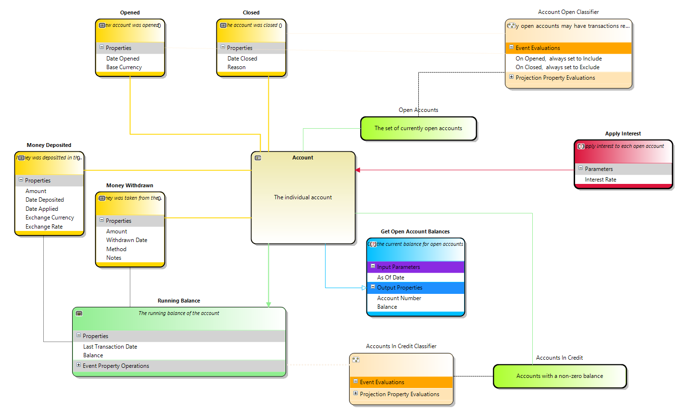
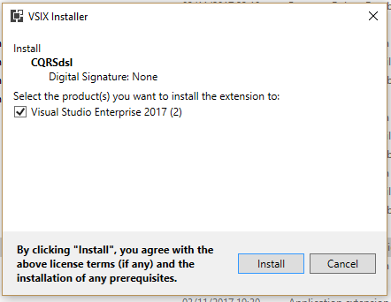

# CQRSDesigner
A graphical designer hosted by Visual Studio to create / codegen CQRS - Event Sourcing based solutions in C# or VB.Net

The visual model for each aggregate is created by adding the [events](event.md) that can occur, the [projections](projection.md) and [classifiers](classifier.md) that can be run agains these events, the [commands](command.png) that change state in the aggregate and the [queries](query.md) that can be run to get state information out of the system.

## Introduction to CQRS

## Introduction to Event Sourcing

## Installing the designer

To intall the CQRS Designer you can install directly from nuget or download the .vsix file from the binaries directory
 

## Using the designer

