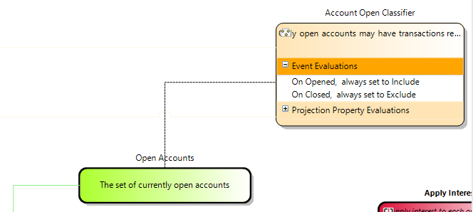

# Classifiers

A classifier is a special type of [projection](projection.md) that is used to decide if an aggregate is "in" or "out" of a given 
[identifier group](identifier_group.md).

This allows for performing rudimentary set-based operations over an event sourcing system without the need to worry about locking
the read model or running off stale eventually consistent data.

A classifier can either be deinfined with an event filter in the same way as a projection is defined, or it can use and existing projection
and perform a logical operation on the return from that projection to decide if an aggregate is inside or outside of the identifier group.

## Generated code
