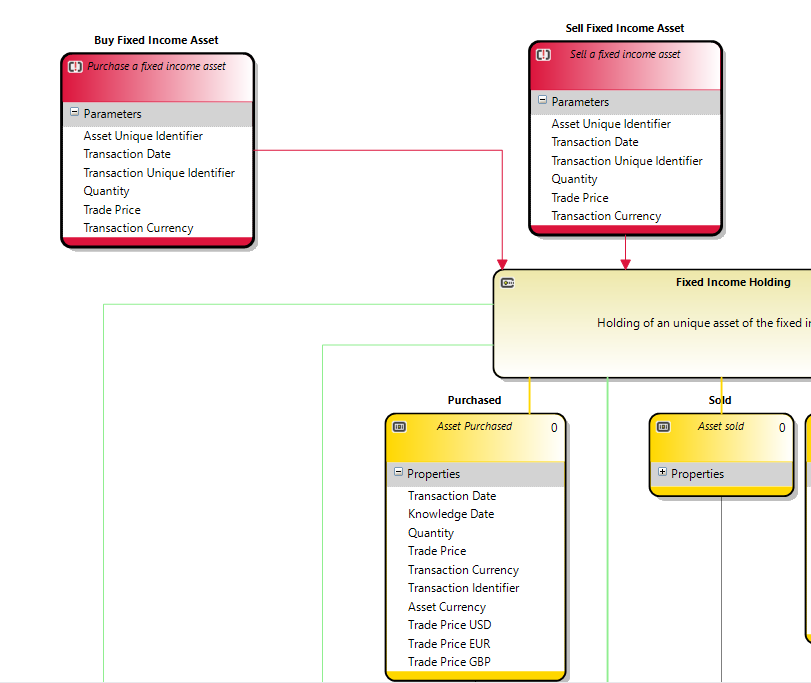

# Commands

A command is an instruction from outside of a domain that will cause one or more state changes inside the command.

A command may have parameters which are used to decide what (and to which aggregates) is done.

## Generated code
