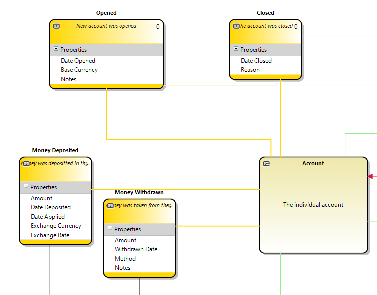

# Events

An event is a record that something of interest happened to the object identified by the aggregate identifier.
Events are stored in order of occurrence and this allows for the most powerful aspects of event sourcing - 
the ability to recreate the state of your object as it was at any given point in time by replaying the events into it. 
(These views of the state of an aggregate when events are applied are generated by [projections](projection.md) ).

Each event can only be linked to one aggregate identifier.  This means that if you have a business change that causes a change to
more than one aggregate you must add an event to each one affected. 

## Event Type
Each event type must have an unique name of be uniquely identifiable.  By convention this is a past tense verb and care should
be taken to use the language of the business to define this.  This means that event types with names like "updated" or "modified"
are best avoided.

## Generated code

The generated code is simply a "plain old CLR object" containing the business properties that can be recorded for the event.  
We do not include the navigation or storage properties as they are added in an [event wrapper](event_wrapper.md) when the event
is stored - this is to prevent the use of non-business properties in [projection](projection.md) and [classifier](classifier.md) code.
