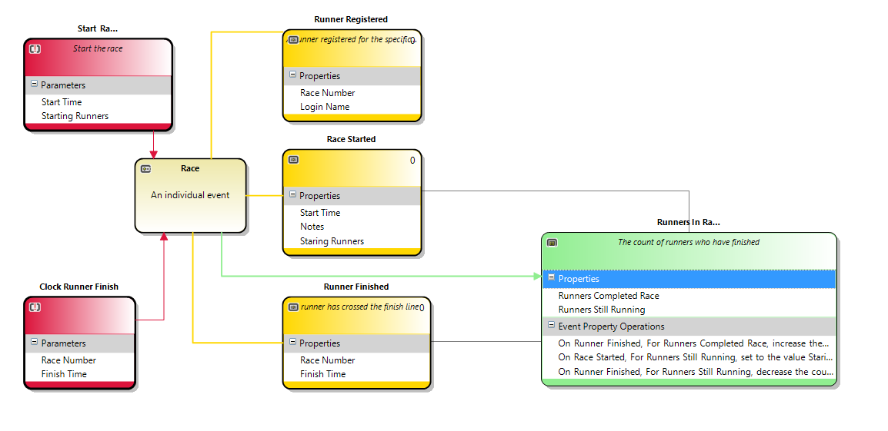

# The Long Run

This example shows a domain hosted on Azure with AppendBlob storage used to store the event streams and command and queries
getting to the domain via EventGrid triggers.  

## The league

The league domain tracks events occuring to the league itself - seasons starting, new clubs joining and so on.

## The race

The race domain tracks events occuring within the context of a race.  The race starting, laps completed, race finished and so on.

## The runner

The runner domain traces events that occur to a runner such as registering for a race, getting a personal best time and so on.
