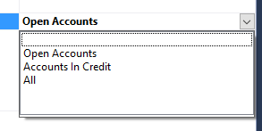

# Identifier groups

An identifier group is a logical group of unique identifiers of [aggregated](aggregate.md) which belong to some business-meaningful set.

Membership of an identifier group is decided by running a [classifier](classifier.md) over the event stream of each possible member 
which returns an "in" or "out" ruling according to the events in that aggregate's event stream.
