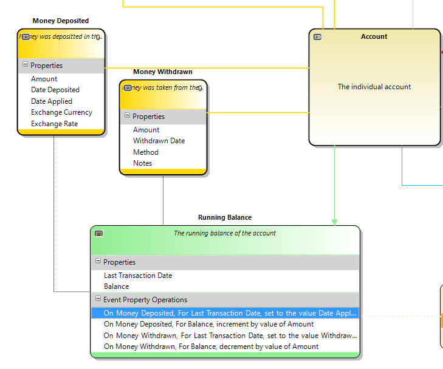
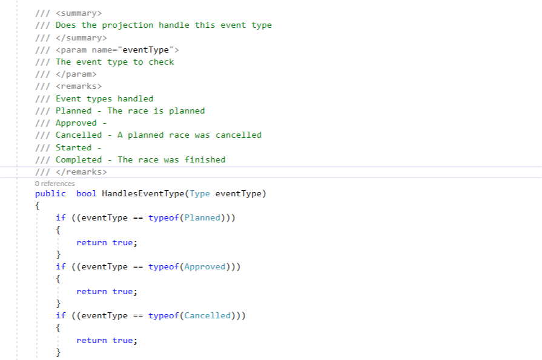

# Projections

A projection takes the stream of events that were recorded against a given aggregate identifier and uses them to create a view of the 
state of the object that the aggregate represents as at a given point in time.

A projection can only apply to one aggregation identifier.  If you want to project the state of multiple aggregate identifiers a 
seperate projection must be run for each one but this is an entirely decoupled operation so can be performed in a highly parrallel 
manner.

A projection can filter which events it does or does not process - events which have no impact on the state of the projection can be 
ignored.  For events that are handled the projection properties can be updated according to the properties of the event being handled.

# Caching results

For performance reasons it is sometimes desirable to cache the results of a projection such that subsequent runs of that projection only
continue from the "last run up to" sequence in the cached projection.  

It is also possible to use cached values of projections to be the basis for the read model in your CQRS architecture, and to make them 
available to other systems in a microservices architecture.

# Generated code

The generated code for any given projection has two parts - a filter function that decides if the projection will handle a 
given [event type](event.md) and a handler function that updates the projection property.

