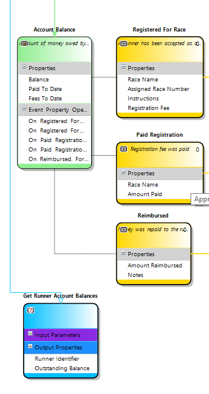

# Queries

A query is the mechanism by which state information can be retrieved from the domain.

A query can have parameters that indicate which aggregates or [identifier groups](identifier_group.md) the data should be retrieved from 
and any filter conditions to apply.

## Generated code
